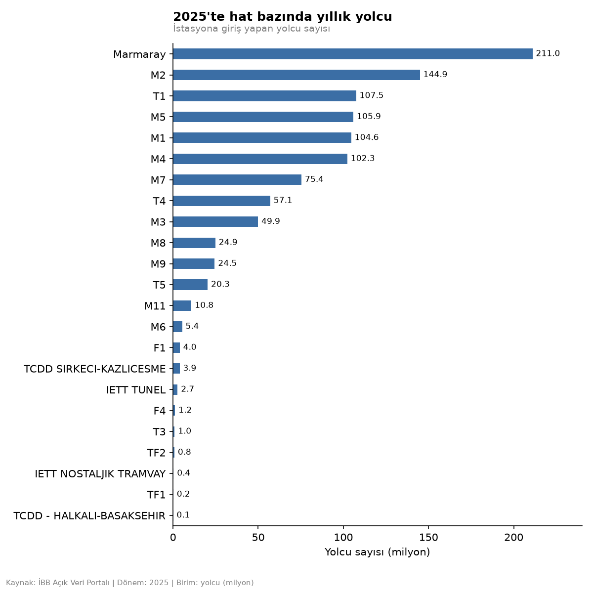
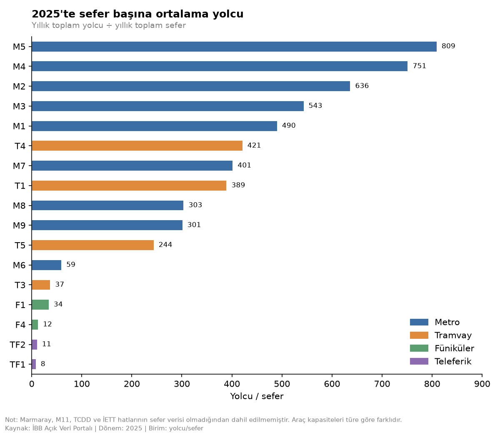
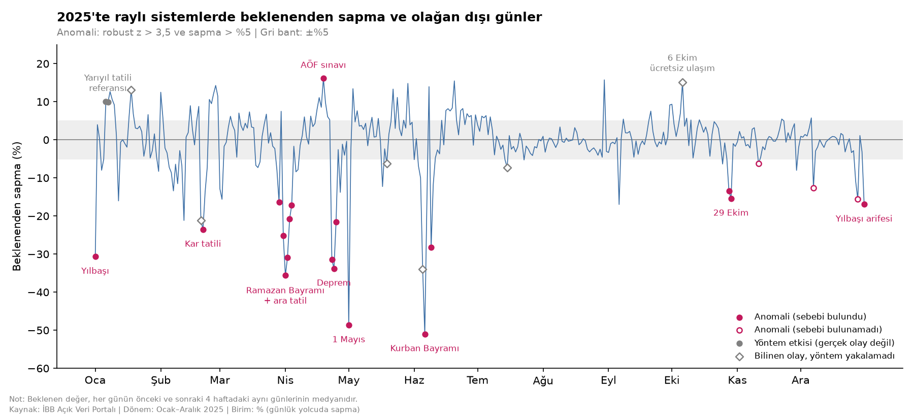
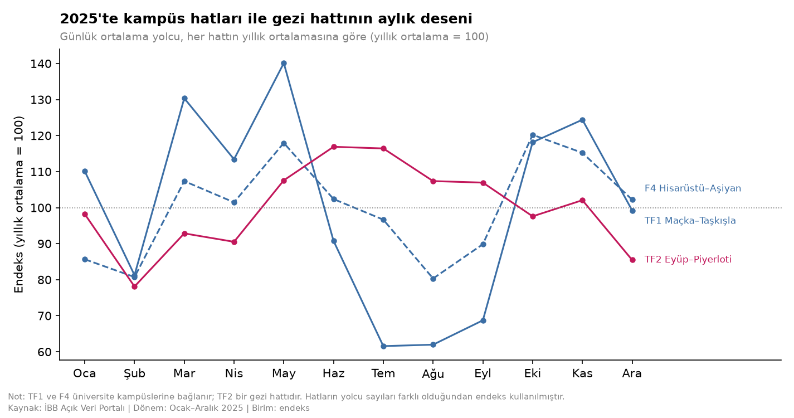

# İstanbul Raylı Sistemler 2025 Analizi

## Projenin amacı

Bu projede, İstanbul'daki raylı sistemlerin 2025 yılı kullanımını yolcu verileri üzerinden incelemeyi amaçladım. Metro, tramvay, füniküler, teleferik ve Marmaray hatlarını karşılaştırarak hangi hatların daha yoğun olduğunu, kullanımın yıl boyunca nasıl değiştiğini ve farklı hatların yolcu profillerinin nasıl ayrıştığını anlamaya çalıştım.

Ayrıca yıl içinde olağan dışı yolcu hareketlerinin yaşandığı günleri tespit edip bunların olası nedenlerini inceledim. İstasyon bazındaki yolcu sayılarını da interaktif bir harita üzerinde görselleştirdim.

Projede temel olarak şu sorulara cevap aradım:

- İstanbul'da en çok kullanılan raylı sistem hatları hangileri?
- Sefer başına en fazla yolcu taşıyan hatlar hangileri?
- Raylı sistem kullanımı yıl boyunca nasıl değişiyor?
- Olağan dışı yolcu yoğunluğu veya düşüşü yaşanan günler hangileri?
- Hatların yolcu yaş grupları birbirinden nasıl farklılaşıyor?
- Kampüs ve gezi amaçlı kullanılan hatlarda dönemsel veya mevsimsel değişimler görülüyor mu?
- İstasyon bazında yolcu dağılımı İstanbul genelinde nasıl?

## Bağlantılar

- **[İnteraktif istasyon kullanım haritası](https://ismailsamib.github.io/istanbul-rayli-sistemler/harita/istasyon_kullanim_haritasi.html)**
- **[İBB Açık Veri Portalı](https://data.ibb.gov.tr)**

## Öne çıkanlar

- 2025'te raylı sistemlerde yaklaşık 1,06 milyar giriş yapıldı. İlk altı hat toplam yolcunun %73'ünü taşıyor. Marmaray tek başına toplamın yaklaşık beşte birine sahip.
- Toplam yolcu sayısında Marmaray ilk sırada. Sefer başına yolcu sayısında ise M5 öne çıkıyor (sefer başına 809 yolcu).
- Yıl içindeki en büyük düşüşler bayramlarda, 20-21 Şubat'taki kar tatilinde, 23 Nisan depreminde ve 1 Mayıs'ta görüldü. 1 Mayıs'ta 45 istasyonda giriş sayısı neredeyse sıfıra indi.
- TF1, F4 ve M6 üniversite kampüslerine hizmet veriyor. Üçünde de yaz aylarında belirgin bir düşüş var ve 20-30 yaş grubunun oranı en yüksek üç hat bunlar.

## Grafikler

### Hat bazında yıllık yolcu



### Sefer başına yolcu



Toplam yolcu sayısında 4. sırada olan M5, sefer başına yolcuda ilk sıraya çıkıyor. T1 toplamda 3. sırada olmasına rağmen çok daha fazla sefer yaptığı için bu grafikte 8. sırada. Marmaray, M11, TCDD ve İETT hatlarının sefer verisi bulunmadığı için bu grafikte yer almıyor.

### Olağan dışı günler



Her günü, önceki ve sonraki dört haftanın aynı günleriyle karşılaştırdım. Kırmızı noktalar yöntemin tespit ettiği anomalileri, gri elmaslar ise bilinen ancak yöntemin yakalayamadığı olayları gösteriyor.

### Kampüs hatları ve gezi hattı



18 Ocak'ta TF1'de dikkat çeken bir artış gördüm. O hafta finaller vardı ve TF1, İTÜ Taşkışla'ya gidiyor. Buradan yola çıkarak kampüs hatlarının akademik takvimle, gezi hattı TF2'nin ise mevsimle nasıl değiştiğine baktım.

Diğer grafikler (hat payları, en yoğun 10 istasyon, aylık seyir, yaş dağılımı, hafta sonu kullanımı ve 60+ oranı ile hafta sonu kullanımı arasındaki ilişki) `figures` klasöründe bulunuyor.

## İstasyon kullanım haritası

**[Haritayı aç](https://ismailsamib.github.io/istanbul-rayli-sistemler/harita/istasyon_kullanim_haritasi.html)**

293 istasyonun 2025 yılı yolcu sayılarını gösteren etkileşimli harita. Dairelerin büyüklüğü yolcu sayısını (karekök ölçeği), renkler ise hatları gösteriyor. Hat adına tıklayarak yalnızca o hattı görebilirsiniz. Hat güzergâhları, duraklar arasındaki gerçek ray geometrileri kullanılarak OpenStreetMap verilerinden oluşturuldu.

İstasyon koordinatlarının çoğu İBB verisindeki orijinal koordinatlardan alındı. Ray güzergâhından 140 metreden fazla sapan 9 istasyonun konumu, OpenStreetMap'teki durak noktalarına göre düzeltildi. En büyük fark M9 Ataköy'de yaklaşık 800 metreydi. İstasyon adlarındaki yazım hatları ve mükerrer kayıtlar da ayrıca düzeltildi.

Haritanın nasıl oluşturulduğuna dair ayrıntılar `harita/README.md` dosyasında bulunuyor.

Altlık: Esri World Gray Canvas (açık/koyu tema).  
Kaynaklar: Yolcu verileri İBB Açık Veri Portalı; ray geometrileri ve durak noktaları © OpenStreetMap katkıcıları (ODbL).

## Veri

Projede iki veri seti kullandım. İkisi de [İBB Açık Veri Portalı](https://data.ibb.gov.tr)'ndan alındı:

- 2025 yılı, istasyon ve yaş grubu bazında günlük yolcu sayıları (678.010 satır, 23 hat)
- Raylı sistemlerde hat bazında aylık sefer sayıları (2017-2025)

Veri dosyaları boyutları nedeniyle repoya eklenmedi. Projeyi çalıştırmak için bu dosyaları portaldan indirip proje klasörüne koymanız gerekiyor.

## Veri temizliği

- Koordinat sütunları bozuktu; ondalık noktaları kaymıştı. Analizde de kullanılmadıkları için çıkardım.
- T3 ve nostaljik tramvayda istasyon adı bulunmuyordu. Bu hatlarda istasyon bazında veri tutulmadığı için istasyon adı yerine hat adını kullandım.
- M7'de iki istasyonun ilçe bilgisi eksikti. Kazım Karabekir veride Esenler olarak geçiyordu; gerçekte Gaziosmanpaşa'da olduğu için düzelttim.
- Yaş grubundaki `"Unkown"` yazım hatasını düzelttim ve yaş gruplarını sıralı kategori haline getirdim.
- Hat adlarından kısa kodları çıkardım (M1, T1 gibi). `"TCDD TASIMACILIK A.S."` kaydının Marmaray'ı ifade ettiği anlaşıldığı için adını değiştirdim.
- Sefer verisindeki boş hücreler her zaman 0 anlamına gelmiyor. Bazı hatlarda hat henüz açılmamışken, bazılarında veri tutulmamış. Örneğin T3, TF1 ve TF2 verileri birlikte Ocak 2018'de başlıyor. Bu yüzden boş hücreleri 0 olarak doldurmak yerine çıkardım.

## Yöntem notları

**Anomali tespiti:** Veride belirgin bir haftalık döngü olduğu için her günü önceki ve sonraki dört haftanın aynı günleriyle karşılaştırdım. Sapmayı ortalama ve standart sapma yerine medyan ve MAD kullanarak ölçtüm (robust z). Bunun nedeni, uç değerlerin ortalamayı etkileyerek bazı anomalileri gizleyebilmesi.

Bir günü anomali olarak işaretlemek için iki koşul kullandım: `|robust z| > 3,5` ve sapmanın `%5`'ten büyük olması.

Bu yöntem, önceden bildiğim 18 olayın 12'sini yakaladı. Kaçırdığı olayların bir kısmı ücretsiz ulaşımın olduğu tatiller. Bu günlerde işe gidenlerin sayısı azalırken gezi amaçlı yolculuklar arttığı için toplamda büyük bir fark oluşmayabiliyor.

Bazı olaylar da okul açılışı gibi geçiş dönemlerine denk geliyor. Referans günler kendi içinde dağınık olduğunda, yöntem aynı büyüklükteki bir sapmayı daha az sıra dışı olarak değerlendiriyor.

**60+ oranı ve hafta sonu kullanımı:** Hat bazında Spearman korelasyonu ρ = 0,62 (p = 0,002, bootstrap %95 güven aralığı 0,30-0,82, n = 23).

Bu, hatlar arasındaki bir ilişkiyi gösteriyor; "yaşlılar hafta sonu daha çok seyahat ediyor" şeklinde yorumlanmamalı. Bana göre burada ortak etken daha çok hattın karakteri. Kısa, merkezi ve gezi amaçlı kullanılan hatlar hem 60+ yolcuları hem de hafta sonu yolcularını daha fazla çekiyor olabilir.

**Yolcu sayısı:** Veride `passage_cnt` ve `passanger_cnt` olmak üzere iki farklı sayı bulunuyor. `passage_cnt` hiçbir yerde `passanger_cnt` değerinden düşük değil. Özellikle gezi hatlarında ve 60+ grubunda aradaki fark daha büyük.

Muhtemelen "yolcu" değeri farklı kartları ölçüyor. Bir kartla birden fazla kişi geçebilirken, aynı kişi gün içinde aynı istasyondan birden fazla kez giriş yapabiliyor. Analizlerde `passanger_cnt` değerini kullandım.

## Sınırlılıklar

- Analizde yalnızca 2025 yılı verisi kullanıldı.
- Kart paylaşımı ve kart basmadan yapılan geçişler (örneğin küçük çocuklar) nedeniyle bazı hatlarda gerçek kullanım veride görünenden daha yüksek olabilir.
- Araç kapasitesi verisi olmadığı için sefer başına yolcu sayısı doluluk oranını göstermiyor.
- Veri günlük olduğu için saatlik yoğunluğu inceleyemedim.
- Anomali açıklamaları takvim ve haber taramasına dayanıyor. 19 Nisan'ı (AÖF sınavı) "olası" olarak işaretledim. 11 Kasım ile 7 ve 28 Aralık'taki anomalilerin nedenini bulamadım.
- TCDD Halkalı-Başakşehir veride yalnızca 3 istasyonla yer alıyor.

## Proje yapısı

```text
clean_data.py      yolcu verisini temizler, passenger_clean.csv üretir
clean_trips.py     sefer verisini temizler, trips_clean.csv üretir
analiz.ipynb       tüm analizler ve grafikler
figures/           grafikler
harita/            istasyon kullanım haritası ve onu oluşturan script
```

## Nasıl çalıştırılır

```text
python -m venv venv
venv\Scripts\activate
pip install pandas openpyxl matplotlib scipy ipykernel
python clean_data.py
python clean_trips.py
```

Ardından `analiz.ipynb` dosyasını açıp hücreleri çalıştırmak yeterli.
